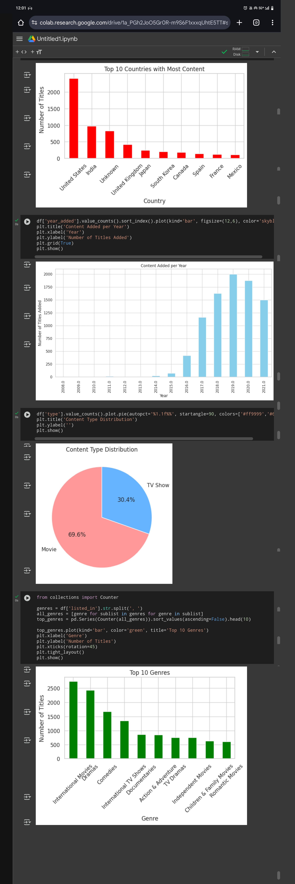

# 📺 Netflix Content Analysis

This project explores and analyzes the content available on Netflix using the publicly available dataset `netflix_titles.csv`. The analysis includes data cleaning, exploratory data analysis (EDA), and visualization of key trends in Netflix's offerings across different countries, genres, and years.

---

## 📂 Dataset

- **Source**: Kaggle - [Netflix Movies and TV Shows](https://www.kaggle.com/datasets/shivamb/netflix-shows)
- **File**: `netflix_titles.csv`

---

## 📓 Jupyter Notebook

- **Notebook Name**: `Netflix_Content_EDA.ipynb`
- Contains step-by-step EDA, preprocessing, and data visualization.

---

## 📊 Visual Insights

Explore key patterns and trends from the Netflix dataset using EDA visualizations:

- **Netflix Content EDA Visuals**  
  

---

## 📌 Key Insights

- The number of TV Shows on Netflix has steadily increased over the years.
- The USA contributes the highest amount of Netflix content, followed by India and the UK.
- Most of the content added is after 2015, showing Netflix’s rapid growth.
- "Drama", "International Movies", and "Comedies" are among the most common genres.
- A large chunk of content was added in July, October, and December.
- Missing values were mostly found in `director`, `cast`, and `rating` columns.

---

## 🛠️ Tools Used

- Python 🐍  
- Pandas 📊  
- Matplotlib & Seaborn 📈  
- Jupyter Notebook 📓  
- GitHub 💻  

---

## 📁 Repository Structure
Netflix-Content-Analysis/
│
├── netflix_titles.csv
├── Netflix_Content_EDA.ipynb
├── Netflix Content EDA Visuals.jpg
└── README.md
---

## 🙌 Credits

- Dataset by Shivam Bansal via Kaggle
- Project by Pranjal Dubey
